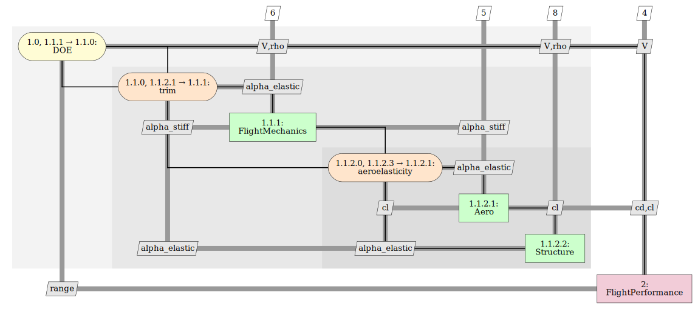

# mdax-aeroperformance

This repository contains an example use case for aero-performance computations using the [AGILE paradigm](https://www.researchgate.net/project/AGILE-40-Towards-cyber-physical-collaborative-aircraft-development).

Anaconda is the recommended environment manager to run the tools in this repository.

To install all required packages into your Anaconda environment, change into the repo folder and type the following:
```
conda env create --file environment.yaml
```

If you are unable to use Anaconda, you can create your (Python 3.8) environment using a manager of your choice, and run 
```
pip install -r requirements.txt
```

Once you set up your Python environment, you can integrate the tools in RCE. Follow the descriptions in 
the [docs](./doc/rce-tool-integration.pdf).

To get an impression of the workflow, see [examples](./example). Here you also find an input file for workflow execution.

For comments or feedback contact us at [andreas.pagerisueno@dlr.de](mailto:andreas.pagerisueno@dlr.de).

